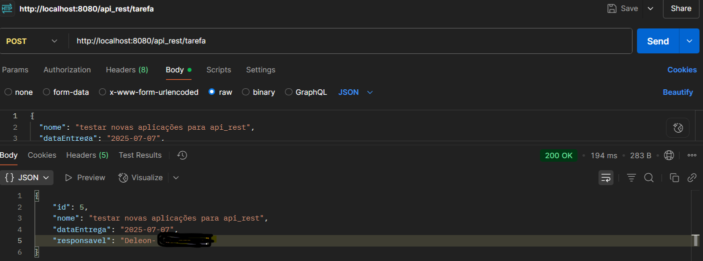

# API de Gerenciamento de Tarefas

[](https://www.java.com/)
[](https://spring.io/projects/spring-boot)

Uma API RESTful simples para gerenciamento de tarefas, permitindo operações de criação, consulta, atualização e remoção (CRUD) de tarefas. Este projeto foi desenvolvido como parte de uma atividade prática de Desenvolvimento Web Back-end.

## Funcionalidades (Endpoints da API)

A API expõe os seguintes endpoints REST para manipulação das tarefas:

| Método HTTP | Endpoint                       | Descrição                                         | Corpo da Requisição (Exemplo)                                    | Resposta (Exemplo)                                      |
| :---------- | :----------------------------- | :------------------------------------------------ | :--------------------------------------------------------------- | :------------------------------------------------------ |
| `POST`      | `/api_rest/tarefa`            | Cria uma nova tarefa.                             | ```json { "nome": "Ler livro X", "dataEntrega": "2025-08-01", "responsavel": "João" } ``` | `201 Created` ou `200 OK` (com a tarefa criada, incluindo ID) |
| `GET`       | `/api_rest/tarefa`            | Lista todas as tarefas cadastradas.               | -                                                                | `200 OK` (lista de tarefas em JSON)                     |
| `GET`       | `/api_rest/tarefa/{id}`       | Consulta uma tarefa específica pelo ID.           | -                                                                | `200 OK` (tarefa encontrada) ou `404 Not Found`         |
| `PUT`       | `/api_rest/tarefa/{id}`       | Atualiza uma tarefa existente pelo ID.            | ```json { "nome": "Finalizar livro X", "dataEntrega": "2025-08-05", "responsavel": "João Silva" } ``` | `200 OK` (tarefa atualizada) ou `404 Not Found`         |
| `DELETE`    | `/api_rest/tarefa/{id}`       | Remove uma tarefa específica pelo ID.             | -                                                                | `200 OK` (com mensagem de sucesso) ou `404 Not Found`   |

## Tecnologias Utilizadas

Este projeto utiliza as seguintes tecnologias e frameworks:

* **Linguagem:** Java 21
* **Framework:** Spring Boot 3.2.5
    * **Spring Web:** Para construção de APIs RESTful.
    * **Spring Data JPA:** Para abstração e simplificação do acesso a dados com JPA (Hibernate).
    * **Spring Boot DevTools:** Para produtividade em desenvolvimento (reload automático).
    * **Spring Boot Starter Validation:** Para validação de dados em requisições.
* **Banco de Dados:** MySQL 8.0
* **Driver JDBC:** MySQL Connector/J
* **Ferramenta de Build:** Apache Maven
* **Controle de Versão:** Git
* **Hospedagem de Código:** GitHub
* **Cliente REST para Teste:** Postman (ou Insomnia, cURL, VS Code REST Client)

## Pré-requisitos

Antes de rodar a aplicação, certifique-se de ter instalado:

* **Java Development Kit (JDK) 21** ou superior.
* **Apache Maven** (geralmente incluído com o Spring Boot CLI ou integrado em IDEs).
* **MySQL Server** (versão 8.0 ou superior).
* **Git**.

## Configuração do Banco de Dados

1.  Crie um banco de dados MySQL chamado `db_tarefas`.
    ```sql
    CREATE DATABASE db_tarefas;
    ```
2.  Atualize as credenciais do banco de dados no arquivo `src/main/resources/application.properties` conforme seu ambiente MySQL:

    ```properties
    spring.datasource.url=jdbc:mysql://localhost:3306/db_tarefas?useSSL=false&serverTimezone=UTC&createDatabaseIfNotExist=true
    spring.datasource.username=seu_usuario_mysql
    spring.datasource.password=sua_senha_mysql
    spring.datasource.driver-class-name=com.mysql.cj.jdbc.Driver

    spring.jpa.hibernate.ddl-auto=update # Cria/atualiza tabelas automaticamente
    spring.jpa.show-sql=true
    spring.jpa.open-in-view=false # Desabilita o Open Session In View (opcional, mas recomendado)
    ```
    **Lembre-se de substituir `seu_usuario_mysql` e `sua_senha_mysql` pelas suas credenciais reais.**

## Como Clonar e Rodar a Aplicação

Siga os passos abaixo para obter uma cópia local do projeto e executá-lo.

### Clonar o Repositório

Abra seu terminal ou prompt de comando e execute:

```bash
git clone [https://github.com/SEU_USUARIO/SEU_REPOSITORIO.git](https://github.com/SEU_USUARIO/SEU_REPOSITORIO.git)
cd SEU_REPOSITORIO
```
### Estrutura e execução


Execute a Aplicação dentro de com.exemple para rodar a API 

Se executando com sucesso será exibito no seu terminal a informaação "Tomcat started on port 8080 (http) with context path '/'".


Utilise ```http://localhost:8080/api_rest/tarefa``` na interface do Postman e efetue os teste.

  **Para inicia os teste memece incerindo valores referente as variaveis nome, data  responsavel e então sega para as outras operaçãos.
  


##Contribuição

Contribuições são bem-vindas! Sinta-se à vontade para abrir problemas ou solicitações de pull.

